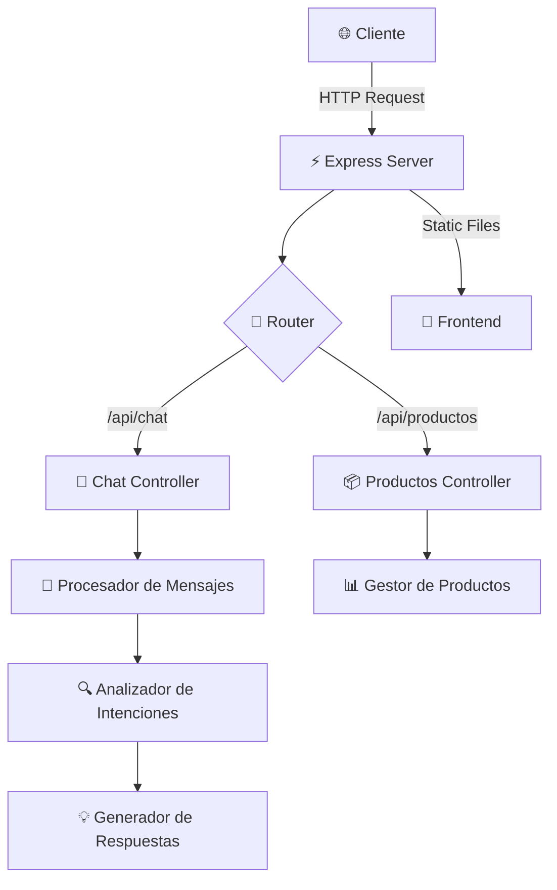

<div align="center">

# 🤖 ShopBot

### *Tu Asistente Virtual Inteligente para Compras*

[](https://nodejs.org/)
[](https://expressjs.com/)
[](https://swagger.io/)
[](LICENSE)

**[Demo en Vivo](#-inicio-rápido)** • **[Documentación API](#-api-endpoints)** • **[Arquitectura](#-arquitectura)** • **[Contribuir](#-contribuir)**

---

</div>

## 💡 ¿Qué es ShopBot?

> **ShopBot** es un asistente virtual conversacional que revoluciona la experiencia de compra en línea. Con inteligencia artificial básica y procesamiento de lenguaje natural, ayuda a los clientes a encontrar productos, consultar precios y resolver dudas al instante.

```
┌─────────────────────────────────────────────────────────────┐
│  👤 Usuario: "Hola, busco una laptop para diseño gráfico"  │
├─────────────────────────────────────────────────────────────┤
│  🤖 ShopBot: "¡Hola! Te muestro nuestras laptops para      │
│              diseño. Tengo la Dell XPS 13 con i7..."       │
└─────────────────────────────────────────────────────────────┘
```

<details>
<summary><b>🎯 Características Principales</b></summary>

<br>

| Característica | Descripción |
|----------------|-------------|
| 💬 **Chat Inteligente** | Conversaciones naturales con análisis de intenciones |
| 🔍 **Búsqueda Avanzada** | Encuentra productos por nombre, categoría o descripción |
| 💰 **Información de Precios** | Consulta precios actuales y descuentos en tiempo real |
| 📦 **Control de Stock** | Verifica disponibilidad instantánea de productos |
| 🎨 **Interfaz Responsive** | Diseño adaptable a móviles, tablets y desktop |
| 🌓 **Temas Personalizables** | Modo claro/oscuro para mejor experiencia visual |
| 📊 **API RESTful** | Endpoints documentados con Swagger |
| ⚡ **Alta Velocidad** | Arquitectura modular optimizada para rendimiento |

</details>

---

## 🚀 Inicio Rápido

### Instalación en 3 Pasos

```bash
# 1️⃣ Clonar el repositorio
git clone https://github.com/tu-usuario/shopbot.git
cd shopbot

# 2️⃣ Instalar dependencias
npm install

# 3️⃣ Iniciar el servidor
npm run dev
```

### 🎉 ¡Listo!

Abre tu navegador en: **http://localhost:3000**

<details>
<summary><b>📋 Comandos Disponibles</b></summary>

```bash
npm start          # 🚀 Inicia en modo producción
npm run dev        # 🔧 Modo desarrollo con recarga automática
npm test           # 🧪 Ejecuta pruebas (próximamente)
```

</details>

---

## 🏗️ Arquitectura

<div align="center">



</div>

### 📂 Estructura Modular (50+ archivos)

<details>
<summary><b>Ver estructura completa del proyecto</b></summary>

```
ShopBot/
│
├── 🎨 vistas/                      # Interfaz de usuario
│   ├── componentes/                # Componentes reutilizables
│   │   ├── encabezado.html
│   │   ├── pie-pagina.html
│   │   ├── ventana-chat.html
│   │   ├── mensaje.html
│   │   └── tarjeta-producto.html
│   └── paginas/                    # Páginas completas
│       ├── inicio.html
│       ├── chat.html
│       └── ayuda.html
│
├── 💅 estilos/                     # Estilos CSS modulares
│   ├── principal.css
│   ├── componentes/
│   │   ├── encabezado.css
│   │   ├── ventana-chat.css
│   │   ├── mensaje.css
│   │   └── [7 archivos más...]
│   └── temas/
│       ├── tema-claro.css
│       └── tema-oscuro.css
│
├── ⚡ scripts/                     # JavaScript del cliente
│   ├── utilidades/                 # Funciones auxiliares
│   │   ├── cargador-componentes.js
│   │   ├── validador.js
│   │   ├── formateador.js
│   │   └── almacenamiento-local.js
│   ├── componentes/
│   │   ├── ventana-chat.js
│   │   └── tarjeta-producto.js
│   ├── servicios/
│   │   ├── servicio-api.js
│   │   ├── servicio-chat.js
│   │   └── servicio-productos.js
│   └── paginas/
│       ├── inicio.js
│       ├── chat.js
│       └── ayuda.js
│
├── 🔧 servidor/                    # Backend Node.js
│   ├── controladores/              # Lógica de controladores
│   │   ├── controlador-chat.js
│   │   └── controlador-productos.js
│   ├── servicios/                  # Lógica de negocio
│   │   ├── procesador-mensajes.js
│   │   ├── analizador-intenciones.js
│   │   ├── generador-respuestas.js
│   │   ├── gestor-historial.js
│   │   └── gestor-productos.js
│   ├── modelos/
│   │   ├── mensaje.js
│   │   └── producto.js
│   ├── middlewares/
│   │   ├── validador-solicitud.js
│   │   ├── manejador-errores.js
│   │   └── registrador-solicitudes.js
│   └── rutas/
│       ├── rutas-chat.js
│       └── rutas-productos.js
│
├── ⚙️ configuracion/               # Configuraciones
│   ├── servidor.js
│   ├── api.js
│   ├── swagger.js
│   └── base-datos.js
│
├── 📌 constantes/                  # Constantes del sistema
│   ├── mensajes.js
│   ├── codigos-estado.js
│   └── eventos.js
│
├── 🛠️ utilidades/                  # Utilidades del servidor
│   ├── utilidades-servidor.js
│   └── utilidades-validacion.js
│
├── 📦 publico/                     # Recursos estáticos
│   ├── imagenes/
│   └── iconos/
│
└── 📄 index.js                     # 🚀 Punto de entrada
```

</details>

---

## 📡 API Endpoints

### 💬 Chat

| Método | Endpoint | Descripción |
|--------|----------|-------------|
| `POST` | `/api/chat/mensaje` | Envía un mensaje al chatbot |
| `GET` | `/api/chat/historial` | Obtiene el historial completo |
| `DELETE` | `/api/chat/historial` | Limpia el historial |

**Ejemplo de Uso:**

```javascript
// Enviar mensaje
fetch('/api/chat/mensaje', {
  method: 'POST',
  headers: { 'Content-Type': 'application/json' },
  body: JSON.stringify({ mensaje: '¿Tienen laptops?' })
})
.then(res => res.json())
.then(data => console.log(data.respuesta));
```

### 📦 Productos

| Método | Endpoint | Descripción |
|--------|----------|-------------|
| `GET` | `/api/productos` | Lista todos los productos |
| `GET` | `/api/productos/:id` | Obtiene un producto específico |
| `GET` | `/api/productos/buscar?q=laptop` | Busca productos |
| `GET` | `/api/productos/categoria/:cat` | Filtra por categoría |

**📚 Documentación Completa:** [http://localhost:3000/api-docs](http://localhost:3000/api-docs)

---

## 🛠️ Stack Tecnológico

<div align="center">

| Categoría | Tecnologías |
|-----------|-------------|
| **Backend** |   |
| **Frontend** |    |
| **API Docs** |   |
| **DevTools** |   |

</div>

---

## 🎨 Capturas

<details>
<summary><b>🖼️ Ver interfaz del chat</b></summary>

```
┌──────────────────────────────────────────────────────────┐
│  ShopBot                                          [  -  ] │
├──────────────────────────────────────────────────────────┤
│                                                            │
│  🤖  Hola! ¿En qué puedo ayudarte?           10:30       │
│                                                            │
│              Busco un mouse inalámbrico        👤         │
│                                                10:31       │
│                                                            │
│  🤖  Tenemos el Logitech MX Master 3          10:31       │
│      por $99.99. ¿Te interesa?                            │
│                                                            │
├──────────────────────────────────────────────────────────┤
│  [Escribe tu mensaje...]                      [ Enviar ]  │
└──────────────────────────────────────────────────────────┘
```

</details>

---

## 🔧 Configuración

### Variables de Entorno

Crea un archivo `.env` basado en `.env.ejemplo`:

```env
PORT=3000
HOST=localhost
NODE_ENV=development
CORS_ORIGIN=*
```

### Personalización

| Archivo | Propósito |
|---------|-----------|
| `configuracion/servidor.js` | Puerto, host, CORS |
| `configuracion/api.js` | Endpoints, paginación |
| `configuracion/swagger.js` | Documentación API |
| `constantes/mensajes.js` | Mensajes del chatbot |

---

## 🤝 Contribuir

¡Las contribuciones son bienvenidas! 🎉

1. **Fork** el proyecto
2. **Crea** tu rama (`git checkout -b feature/nueva-funcionalidad`)
3. **Commit** tus cambios (`git commit -m 'Agrega nueva funcionalidad'`)
4. **Push** a la rama (`git push origin feature/nueva-funcionalidad`)
5. **Abre** un Pull Request

<details>
<summary><b>📝 Guía de Estilo</b></summary>

- ✅ Nombres de variables en español descriptivos
- ✅ Comentarios claros en cada función
- ✅ Un archivo = Una responsabilidad
- ✅ Código modular y reutilizable
- ✅ Evitar archivos extensos (max 200 líneas)

</details>

---

## 📊 Roadmap

- [x] ✅ Arquitectura modular completa
- [x] ✅ Chat básico funcional
- [x] ✅ API RESTful documentada
- [x] ✅ Interfaz responsive
- [ ] 🔄 Integración con base de datos
- [ ] 🔄 Autenticación de usuarios
- [ ] 🔄 Machine Learning para respuestas
- [ ] 🔄 Soporte multiidioma
- [ ] 🔄 Tests unitarios y E2E
- [ ] 🔄 Deploy en producción

---

## 📄 Licencia

Este proyecto está bajo la Licencia **ISC** - ver el archivo [LICENSE](LICENSE) para más detalles.

---

<div align="center">

### 💙 Hecho con amor para revolucionar el e-commerce

**[⬆ Volver arriba](#-shopbot)**

---

*¿Preguntas? Abre un [issue](../../issues) • ¿Ideas? Envía un [PR](../../pulls)*

</div>
