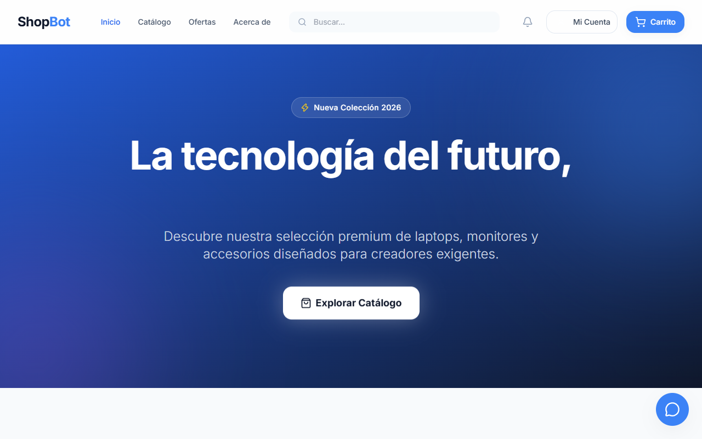
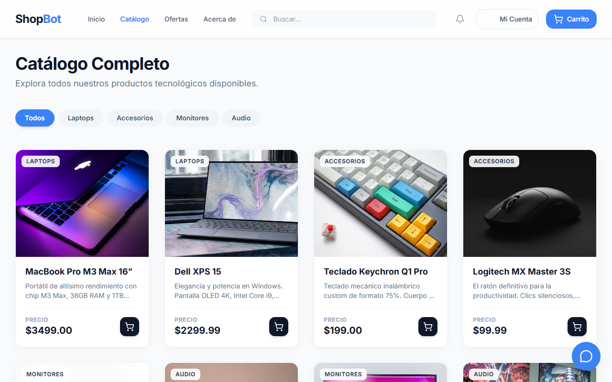
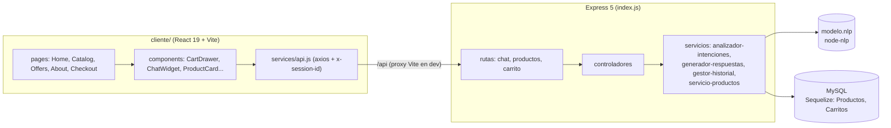
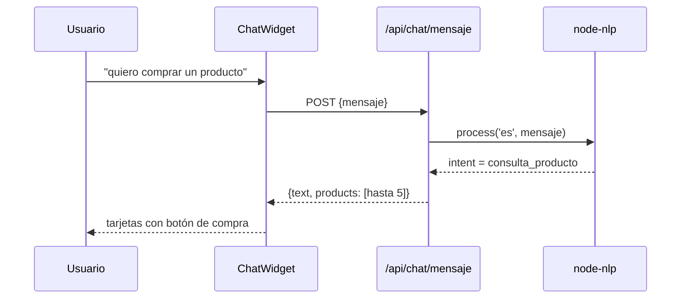

<div align="center">
  
  <h1>ShopBot</h1>
  <p><b>Tienda de tecnología en React con carrito por sesión y un asistente conversacional (Node-NLP) que responde y muestra productos en el chat.</b></p>
  
  
  
  
  
  
  <p>
    <a href="#-inicio-rápido">Inicio rápido</a> ·
    <a href="#-características">Características</a> ·
    <a href="#-arquitectura">Arquitectura</a> ·
    <a href="#-pruebas">Pruebas</a> ·
    <a href="#-lo-que-todavía-no-existe">Limitaciones</a>
  </p>
</div>

**ShopBot** es un e-commerce de demostración: catálogo de productos tecnológicos en una SPA de React, carrito ligado a un identificador de sesión del navegador y un chatbot que detecta la intención del mensaje (saludo, consulta de producto, precio, etc.) con `node-nlp` y contesta con texto, botones de respuesta rápida o tarjetas de producto. **No** procesa pagos reales, no tiene cuentas de usuario funcionales y no incluye inteligencia artificial generativa: el bot elige frases de una lista según la intención.

## 🎬 Vista rápida

| Inicio | Catálogo |
|---|---|
|  |  |

*Capturas reales con el backend y una base MySQL temporal sembrada con `sequelize-cli`. La foto de cada producto se carga desde URLs externas de Unsplash.*

## ✨ Características

| Característica | Detalle |
|---|---|
| Catálogo | Listado de productos con filtros por categoría (Laptops, Accesorios, Monitores, Audio), vista rápida y página de ofertas |
| Carrito | `GET/POST/DELETE /api/carrito`, identificado por la cabecera `x-session-id` (UUID guardado en `localStorage`); drawer lateral y cantidad en el header |
| Checkout de 3 pasos | Envío → pago → confirmación con animaciones. **El pago es simulado**: espera 1,5 s, vacía el carrito y muestra éxito |
| Chatbot | `POST /api/chat/mensaje` con `node-nlp` (modelo `modelo.nlp`, idioma `es`, umbral de score 0,5); devuelve `text`, `options` (respuestas rápidas) y `products` (hasta 5 productos) |
| Historial de chat | En memoria del servidor (últimos 100 mensajes), `GET/DELETE /api/chat/historial` |
| API de productos | `GET /api/productos`, `/buscar?q=`, `/categoria/:categoria`, `/:id` (Sequelize) |
| Interfaz | React Router 7, Framer Motion (transiciones de página y modales), Lucide, toasts con `react-hot-toast` |
| Salud | `GET /api/salud` |

## 🏗️ Arquitectura





<details>
<summary>Estructura de carpetas</summary>

```text
index.js                    # app Express: API + sirve cliente/dist
configuracion/              # servidor, swagger, api, base-datos (config auxiliar)
servidor/
  rutas/ controladores/ servicios/ middlewares/
  models/ migrations/ seeders/ config/config.json   # Sequelize (MySQL)
  modelos/ + servicios/gestor-productos.js          # capa SQLite antigua, sin uso
modelo.nlp                  # modelo entrenado que usa la app (model.nlp es una copia anterior)
tests/rutas-chat.test.js    # único test
cliente/                    # SPA React (Vite, Tailwind, Framer Motion)
spect/                      # spec.md, plan.md, tasks.md (Spec-Driven Development)
```

</details>

## 🚀 Inicio rápido

| Requisito | Versión |
|---|---|
| Node.js | Verificado con v24.15 |
| MySQL | 8.x en `127.0.0.1:3306`, usuario `root` sin contraseña (según `servidor/config/config.json`) |

```bash
git clone https://github.com/Luiss2080/ShopBot.git
cd ShopBot
npm install
cd cliente && npm install && cd ..

# Base de datos (crea antes la base vacía "shopbot_db")
mysql -uroot -e "CREATE DATABASE shopbot_db CHARACTER SET utf8mb4"
npx sequelize-cli db:migrate
npx sequelize-cli db:seed:all

npm run dev:all        # API en http://localhost:3000 + Vite en http://localhost:5173
```

Para servir todo desde Express: `cd cliente && npm run build`, luego `npm start` y abre `http://localhost:3000`.

> Instala primero las dependencias de la **raíz**: `cliente/src/services/api.js` importa `uuid`, que solo se resuelve desde el `package.json` raíz (no está declarado en `cliente/package.json`).

<details>
<summary>Configuración y variables de entorno</summary>

- `PORT` (por defecto 3000), `HOST` (`localhost`) y `NODE_ENV` sí se leen desde el entorno del sistema.
- **No hay `dotenv`**: el archivo `.env.ejemplo` (que menciona MongoDB y `SESSION_SECRET`) no lo lee ninguna parte del código.
- Credenciales de MySQL: se editan directamente en `servidor/config/config.json` (entornos `development`, `test`, `production`).

</details>

## 🧪 Pruebas

```bash
npm test     # Jest + Supertest
```

Hay **1 test** (`tests/rutas-chat.test.js`): comprueba que `POST /api/chat/mensaje` con "hola" responde 200 con `respuesta.text`. Pasa (verificado). No hay tests del carrito, de los productos ni del frontend, ni medición de cobertura.

## 🔒 Seguridad

Es una demo: no hay autenticación, el carrito se identifica solo por un UUID enviado por el cliente y no hay límite de peticiones. `config.json` usa MySQL `root` sin contraseña (solo apto para desarrollo local).

## 🚧 Lo que todavía no existe

- **Sin modo oscuro real**: Tailwind está en `darkMode: 'class'` y el `ChatWidget` tiene clases `dark:`, pero no hay ningún interruptor ni detección del sistema en la app. El README anterior lo prometía.
- **Swagger no está montado**: `index.js` importa `swagger-ui-express` y lo anuncia en consola, pero `/api-docs` devuelve 404.
- **Sin base SQLite**: el backend usa Sequelize con **MySQL**; `shopbot-dev.sqlite`, `modelos/db.js` y `gestor-productos.js` son restos que nada invoca.
- **Pago simulado y login de adorno**: el modal "Mi Cuenta" no llama a ningún backend; el checkout no cobra ni guarda pedidos.
- El buscador del header no tiene lógica conectada.
- El NLP es limitado: entiende pocas intenciones (saludo, despedida, producto, precio, disponibilidad, ayuda, agradecimiento); frases fuera de ellas caen en "desconocida" con botones de respuesta rápida, y algunas frases se clasifican mal (por ejemplo, "quiero ver productos" respondió con una despedida en las pruebas).
- El historial del chat vive en memoria y se pierde al reiniciar; es global, no por usuario.
- Cobertura de pruebas mínima; sin CI.
- Sin `dotenv`, CORS configurado en `configuracion/servidor.js` pero no aplicado, e `.env.ejemplo` desactualizado.
- Las afirmaciones del README anterior sobre "arquitectura MVC con inyección de servicios", "cobertura sólida de tests" y React 18 / Router 6 no se corresponden con el código (hay 1 test, React 19 y Router 7).

## 📄 Licencia

Licencia **MIT** (archivo [`LICENSE`](LICENSE)). El `package.json` dice `ISC`; el archivo LICENSE es el que manda.

<div align="center"><sub>Hecho por Luiss2080 · React + Express + node-nlp</sub></div>
